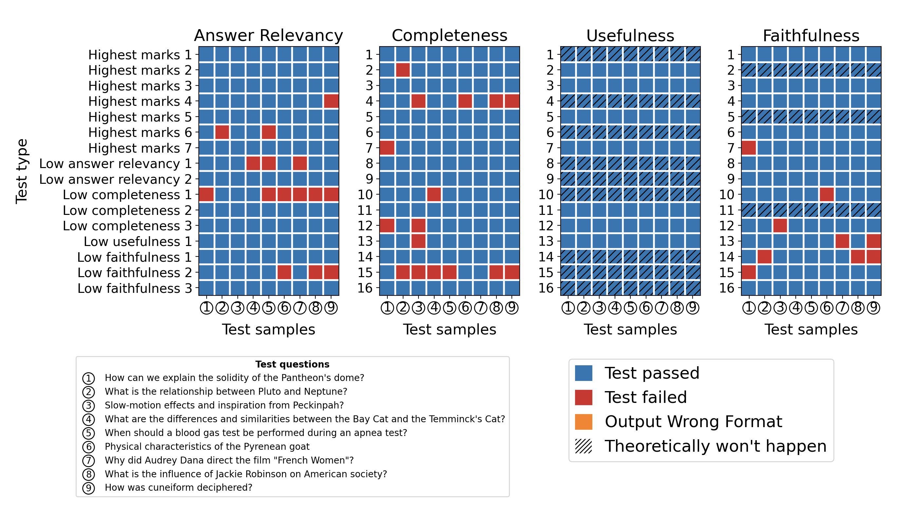

# GroUSE

Evaluate Grounded Question Answering (GQA) models and GQA evaluator models. We implement the evaluation methods described in GroUSE: A Benchmark to Evaluate Evaluators in Grounded Question Answering.

- [Install](#install)
- [Command Line Usage](#command-line-usage)
  - [Evaluation of the Grounded Question Answering task](#evaluation-of-the-grounded-question-answering-task)
  - [Unit Testing of Evaluators with GroUSE](#unit-testing-of-evaluators-with-grouse)
  - [Plot Matrices of unit tests success](#plot-matrices-of-unit-tests-success)
- [Python Usage](#python-usage)
- [Links](#links)
- [Citation](#citation)

## Install

```bash
pip install grouse
```

Then, setup your OpenAI credentials by creating an `.env` file by copying the `.env.dist` file, filling in your OpenAI API key and organization id and exporting the environment variables `export $(cat .env | xargs)`.

## Command Line Usage

### Evaluation of the Grounded Question Answering task

You can build a dataset in a `jsonl` file with the following format per line:

```txt
{
    "references": [...] # List of references,
    "input": "" # Query
    "actual_output": "", # Predicted answer generated by the model we want to evaluate
    "expected_output": "" # Ground truth answer to the input
}
```

You can also check this example `example_data/grounded_qa.jsonl`.

Then, run this command:

```bash
grouse evaluate {PATH_TO_DATASET_WITH_GENERATIONS} outputs/gpt-4o
```

We recommend using GPT-4 as an evaluator model as we optimised prompts for this model, but you can change the model and the prompts with the `--model-name` and `--prompts-path` options.

### Unit Testing of Evaluators with GroUSE

Meta-Evaluation consists in evaluating GQA evaluators with the GroUSE unit tests.

```bash
grouse meta-evaluate gpt-4o meta-outputs/gpt-4o
```

### Plot Matrices of unit tests success

You can plot the results of unit tests in the shape of matrices:

```bash
grouse plot meta-outputs/gpt-4o
```

The resulting matrices look like this:



## Python Usage

```python
from grouse import EvaluationSample, GroundedQAEvaluator

sample = EvaluationSample(
    input="What is the capital of France?",
    # Replace this with the actual output from your LLM application
    actual_output="The capital of France is Marseille.",
    expected_output="The capital of France is Paris.",
    references=["Paris is the capital of France."]
)
evaluator = GroundedQAEvaluator()
evaluator.evaluate([sample])
```

## Links

- [Unit Tests](https://huggingface.co/datasets/illuin/grouse)
<!-- TODO Add link to the model: - [Llama 3 8B Model]() -->

## Citation

```latex
@misc{muller2024grouse,
      title={GroUSE: A Benchmark to Evaluate Evaluators in Grounded Question Answering}, 
      author={Sacha Muller and António Loison and Bilel Omrani and Gautier Viaud},
      year={2024},
      archivePrefix={arXiv},
      primaryClass={cs.IR},
}
```
